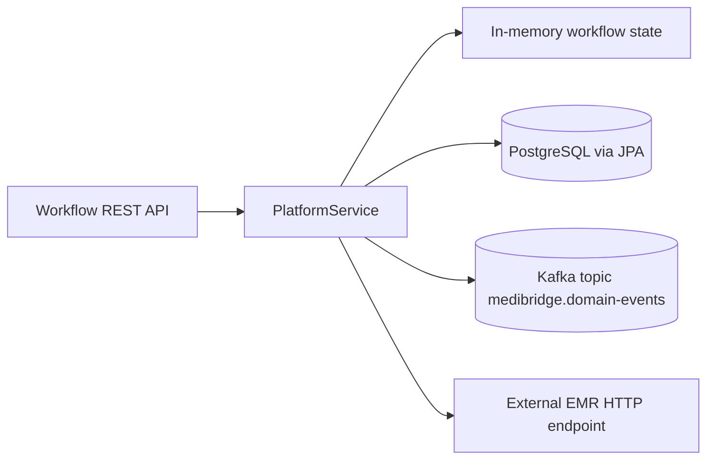

# MediBridge Pulse Platform

A cloud-native Spring Boot reference platform for connected hospital infusion-device integration, event-driven clinical workflows, EMR interoperability, and regulated healthcare traceability.

## Repository purpose

This repository is designed as **professional educational material** for integration testing practices in Java with Spring Boot, Testcontainers, and realistic external-system boundaries.

## Architecture snapshot



## Bounded contexts represented

- Device Fleet Management
- Infusion Therapy Management
- Drug Library Safety
- Clinical Documentation Integration
- Alarm and Escalation Management
- Biomedical Maintenance
- Compliance and Audit Traceability

## Integration-test-first structure

### Key practices implemented

- `AbstractBaseIT` for shared bootstrapping and dynamic wiring
- Singleton reusable containers (PostgreSQL + Kafka)
- WireMock-managed external EMR system
- Boot order: **containers first**, then Spring context
- Unique data per test to avoid interference
- Parallel settings configured but deterministic (`same_thread`)
- Flyway baseline migration for fast schema startup

See detailed course content in: [`docs/integration-testing-course.md`](docs/integration-testing-course.md)

## API resources

- `GET/POST /devices`
- `GET/POST /device-assignments`
- `GET/POST /infusion-orders`
- `GET /therapy-sessions`
- `POST /therapy-sessions/start`
- `POST /therapy-sessions/{id}/progress`
- `POST /therapy-sessions/{id}/complete`
- `GET/POST /drug-libraries`
- `GET/POST /alarms`
- `POST /alarms/{id}/ack`
- `GET /emr-documents`
- `GET/POST /maintenance-tickets`
- `GET /audit-events`
- `GET /events`
- `GET /platform-health`

## Quick start

### Local run

```bash
mvn spring-boot:run
```

### Run unit/smoke tests (Surefire)

```bash
mvn test
```

### Run full verification including integration tests (Failsafe + Testcontainers)

```bash
mvn verify
```

### Dockerized app run

```bash
docker compose up --build
```

## Test suite map

- `MediBridgePulseApplicationTests`
  - context + API smoke checks
- `PlatformWorkflowIntegrationTest`
  - workflow integration via MockMvc
  - PostgreSQL persistence assertions
  - Kafka publication assertions
  - WireMock external EMR verification
  - repeated test for isolation stability

## Future track

- Outbox/inbox reliability patterns
- Feature-flagged `@SpringBootTest(properties = "featureX=true/false")` scenarios
- Contract tests for third-party integration boundaries
- CI split strategy for fast lane vs full integration lane
