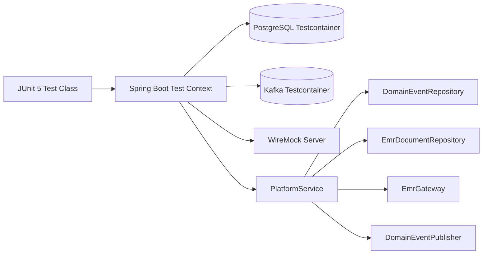
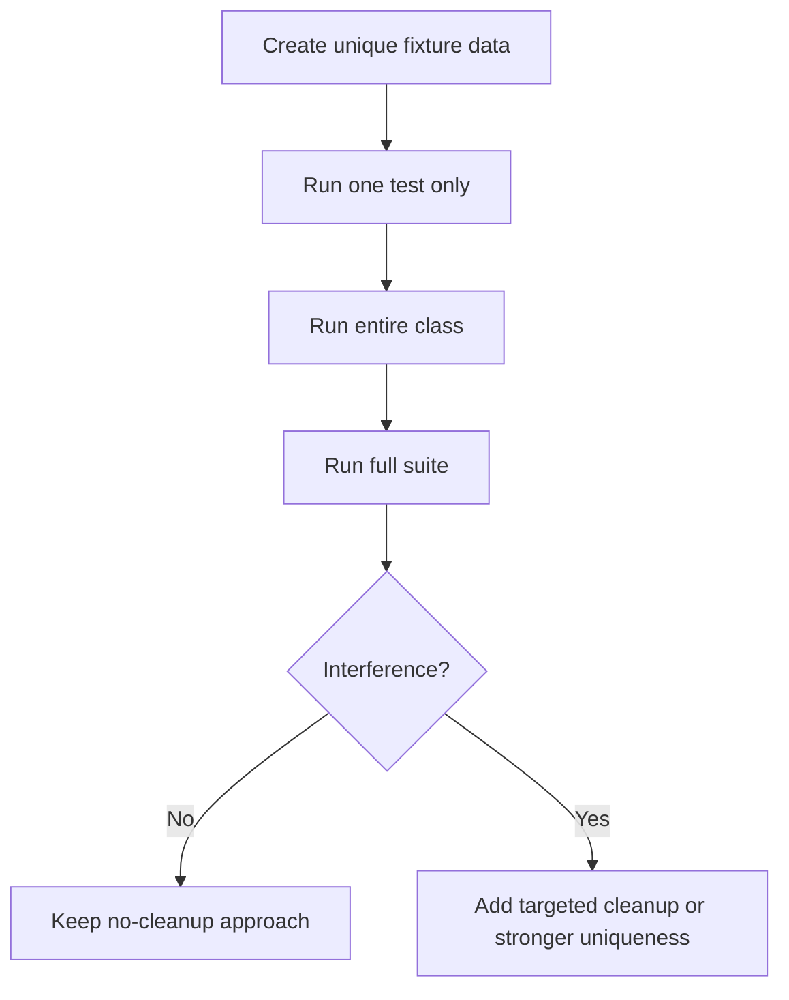

# Integration Testing Course — MediBridge Pulse Platform

## Learning goals

This course material shows a production-style integration test setup with:

- Spring Boot integration tests
- Testcontainers (PostgreSQL + Kafka)
- WireMock for external HTTP systems
- Flyway baseline migrations
- Shared singleton containers for speed
- Isolation rules for parallel-capable suites

## System test topology

## Boot sequence (recommended)

1. **Start external systems first**
   - PostgreSQL
   - Kafka
   - WireMock
2. **Publish dynamic properties** into Spring Boot test context.
3. **Boot Spring context once** and reuse when configuration is identical.
4. **Prepare test data unique per test** (`UUID` based test IDs).
5. **Execute assertions** at API + persistence + integration side-effect level.
6. **Cleanup intentionally** only when isolation cannot be guaranteed by test data design.

## Why singleton containers

Using singleton containers in `AbstractBaseIT` avoids repeated startup cost per test class and gives stable execution times while preserving realistic infrastructure.

> Local developer optimization: `withReuse(true)` is enabled. This should be combined with a local `~/.testcontainers.properties` and used carefully in CI.

## Test isolation loop

## Practical notes and trade-offs

- `@DirtiesContext` is expensive; avoid unless context mutation demands it.
- `deleteAll()` can hide design problems and increase runtime; use only when true shared-state collisions cannot be prevented.
- Prefer profile-driven config (`@ActiveProfiles("integration")`) to maximize Spring test context cache reuse.
- Keep mock integrations deterministic; WireMock stubs should be reset at clear lifecycle points.
- For method-level concurrency, ensure mocks and mutable shared objects are thread-safe first.

## JUnit setup used in this repository

`src/test/resources/junit-platform.properties`:

- `parallel.enabled=true`
- `mode.default=same_thread`
- `mode.classes.default=same_thread`
- dynamic strategy enabled for future tuning

This configuration keeps execution deterministic while still preparing the suite for controlled parallel evolution.

## Suggested exercises

1. Add a consumer-side integration test asserting end-to-end Kafka consumption semantics.
2. Add a failing EMR export scenario with retries and dead-letter modeling.
3. Compare runtime between per-test containers and singleton containers.
4. Introduce feature toggles and test with `@SpringBootTest(properties = "featureX=true")` and `featureX=false`.
